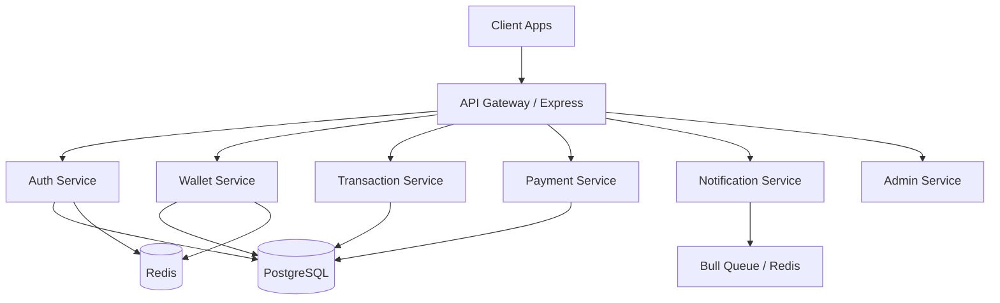

# Digital Payment Wallet Backend System

A production-ready digital payment wallet backend built with Node.js, Express, PostgreSQL, Redis, and JWT authentication.

## Features

- **Authentication**: JWT-based auth with refresh tokens, Redis blacklisting, account locking on failed attempts.
- **Wallet Management**: Multi-currency wallets, daily/monthly transaction limits, balance tracking.
- **Transactions**: Deposits, withdrawals, P2P transfers, and bill payments with idempotency keys.
- **Security**: Rate limiting, Helmet security headers, Joi input validation, optimistic locking for financial operations.
- **Notifications**: System alerts for successful deposits, withdrawals, and transfers.
- **Admin**: Dashboard APIs for user management, wallet freezing/unfreezing, KYC validation, system statistics.

## Prerequisites

- Node.js (v20+)
- PostgreSQL (v15+)
- Redis (v7+)
- Docker & Docker Compose (optional but recommended)

## Quick Start (Docker)

1. Clone the repository
2. Rename \`.env.example\` to \`.env\`
3. Run with Docker Compose:

\`\`\`bash
docker-compose up -d
\`\`\`

The API will be available at \`http://localhost:3000/api/v1\`
API Documentation is at \`http://localhost:3000/api-docs\`

## Quick Start (Manual)

1. Install dependencies:
   \`\`\`bash
   npm install
   \`\`\`

2. Set up your \`.env\` file (configure DB and Redis credentials).

3. Start PostgreSQL and Redis locally.

4. Seed the database with test users:
   \`\`\`bash
   npm run db:seed
   \`\`\`
   *Admin: admin@digitalwallet.com / Admin@1234*  
   *Test User: john@example.com / User@1234 (PIN: 1234)*

5. Start the development server:
   \`\`\`bash
   npm run dev
   \`\`\`

## Architecture

- **Controllers**: Handle HTTP request/response.
- **Services**: Contain core business logic and transaction management (using Sequelize Transactions and row locks).
- **Models**: Sequelize definitions with strict validations and optimistic locking (\`version\`).
- **Middlewares**: JWT auth verification, Redis blacklisting check, Role-based auth, Joi validation schemas.
- **Utils**: Helpers for API responses, custom error handling, structured Winston logging.

## Testing

Run unit and integration tests using Jest:

\`\`\`bash
npm test
\`\`\`

## API Documentation

Once the server is running, visit \`http://localhost:3000/api-docs\` to explore the interactive Swagger UI.
